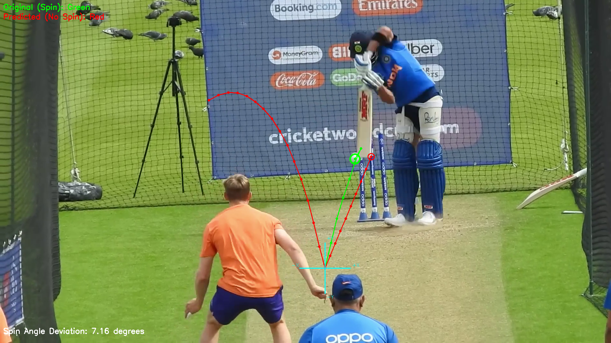

# SpinVision


A computer vision-based project that detects a cricket ball's motion in a video, predicts its post-bounce trajectory assuming no spin, and visualizes the difference between actual and predicted motion.



---

## 🔍 Features

- Detects cricket ball position frame-by-frame using a YOLOv8 model.
- Identifies the bounce point based on vertical motion.
- Simulates post-bounce trajectory without spin.
- Compares actual vs predicted motion to estimate spin deviation.
- Generates an overlay video with trajectory visualization.

---

## 🗂️ Project Structure

```
.
├── coordinates/
│   ├── coordinates.txt               # Detected coordinates
│   └── coordinates_no_spin.txt       # Predicted trajectory
├── model/
│   └── cricket_ball_detector.pt      # YOLOv8 model
├── videos/
│   └── kohli.mp4                     # Input video
├── output/
│   ├── overlay_output.mp4            # Annotated output video
│   └── snapshot_with_spin_angle.png  # Snapshot with trajectory and angle
├── predict.py                        # Predict trajectory without spin
├── coord.py                          # Detect coordinates using YOLO
├── overlay.py                        # Visualize and compare trajectories
├── requirements.txt                  # Python dependencies
└── README.md                         # Project documentation
```

---

## 🚀 Getting Started

### 1. Install Requirements
```bash
pip install -r requirements.txt
```

### 2. Run Coordinate Detection
```bash
python coord.py
```

### 3. Run Trajectory Prediction
```bash
python predict.py
```

### 4. Generate Overlay Video
```bash
python overlay.py
```

---

## 📊 Output Example

The overlay video shows:
- **Green** trajectory: Actual motion (with spin).
- **Red** trajectory: Predicted motion (without spin).
- **Spin Angle Deviation** label post-bounce.

---

## 📌 Notes

- Make sure your YOLO model path and video file path are correctly set.
- Modify frame dimensions if using a video of different resolution.

## 🔗 Model Download

Download the YOLOv8 cricket ball detector model from this link:  
[Download cricket_ball_detector.pt](https://drive.google.com/file/d/1zB0P6IOUDsqf7SNQG_kFi2CjOzTyXFoG/view?usp=drive_link)
Place it in the `model/`


---

## 📄 License

MIT License
